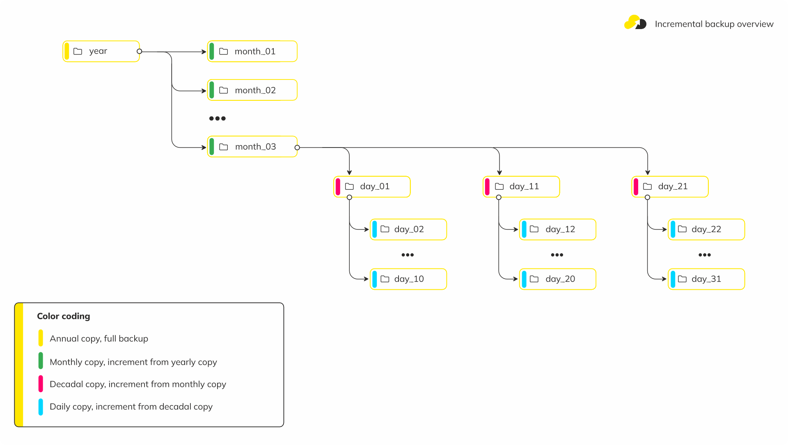

### 3.2. File backups ###

#### 3.2.1. Discrete file backups ####

A discrete file backup is a regular file archive. Backups are created in GNU Tar format.

Requirements:
- To make backups of your files, you have to ensure that you have installed GNU tar of whatever version is available on your OS.
- To back up the files, nxs-backup must be running on the same host where the files are located. Files can be stored locally, or mounted to a local directory.
- There should be enough space in the directory where the temporary backup is created.
- The files should be readable by the user who runs nxs-backup.

Here is an example of configuration for creating a backup of WordPress project files located locally
in directory `/var/www` with the exclusion of log files.
```yaml
job_name: discrete_files
type: files
tmp_dir: /var/backups/tmp_dump

sources:
  - name: "wp_projects"
    save_abs_path: yes
    targets:
      - /var/www/*/wp-content/
    excludes:
      - log
    gzip: true

storages_options:
  - storage_name: local
    backup_path: /var/backups/files/desc
    retention:
      days: 2
      weeks: 0
      months: 0
```

If you need to configure additional storage options or have questions, please visit
the Job storage options page for more details.

**Reference of discrete files backup configuration**
```yaml
# Job unique name
job_name: string # Required

# Type of the backup job: `files`
type: string # Required

# Path to the directory used to temporarily store the backup during the creation process
tmp_dir: string # Required

# The option defines the order of rotation (deletion of old) backups, before creating a new copy or afterwards
safe_rotation: bool # Default: false

# The option allows you to postpone copying until all backup parts of the job are complete before its delivery
deferred_copying: bool # Default: false

# The option enables compression of the backup archive
gzip: bool # Default: false

# Contains resource constraints for a specific job that override all others.
limits: map
  # Limit the write speed to the local disc per second in `bytes`, `kb`, `mb`, etc. Example: "20mb".
  # If "0" is used, there is no limitation.
  disk_rate: string
  # Limit the net speed to remote storages per second in `bytes`, `kb`, `mb`, etc. Example: "12mb".
  # If "0" is used, there is no limitation.
  net_rate: string

# Contains a list of individual subtasks for creating backups
sources: list
  # Unique subtask name, used to separate storage paths
  - name: string # Required
    # List of paths for which backups will be created
    targets: list
      # Path to the files to be backed up. The glob format is supported, in this case a separate backup will be created for each occurrence.
      - string # Required
    # List of entries to exclude from backup
    excludes: list
      # Entry to exclude from the backup. The glob format is supported.
      - string # Optional
    # The option enables compression of the backup archive, overwrites job level
    gzip: bool # Default: false
    # The option activates saving the absolute path of files in the archive
    save_abs_path: bool # Default: true

# List of storages to which backups should be delivered and their rotation rules
storages_options: list
  # The name of the storage added to the main config. The name `local` is used to store a copy on host.
  - storage_name: string # Reuired
    # Path to directory where backups will be stored
    backup_path: string # Reuired
    # Enables backup rotation according to retention parameters.
    enable_rotate: bool # Default: true
    # Set of rules to store and rotate the backups.
    retention: map
      # Use backup retention count instead of retention period.
      count_instead_of_period: bool # Default: false
      # Count of days/daily copies to store backups. Multiple copies can be created in one day.
      days: numeric # Default: 7
      # Count of weeks/weekly copies to store backups created on sunday.
      weeks: numeric # Default: 5
      # Count of months/montly copies to store backups created on the first day of month.
      months: numeric # Default: 12
```


#### 3.2.2. Incremental files backups ####

Incremental backups are file archives containing only the differences between files at specific time intervals.

Backups are created in GNU Tar format.

Incremental copies of files are made according to the following scheme:


At the beginning of the year or on the first start of incremental backup, a full initial backup (identical
to discrete backup) is created.\
Then at the beginning of each month - an incremental monthly copy from a yearly copy is created.\
Inside each month there are incremental ten-day copies. Within each ten-day incremental daily copies are created.

Since the tar file uses the PAX format, you do not need to specify the path to the incremental metadata files
when restoring from an incremental backup. All information are stored in the PAX header `GNU.dumpdir` inside the archive.

Requirements:
1. To make backups of your files, you have to ensure that you have installed GNU tar of whatever version is available on your OS.
2. To back up the files, nxs-backup must be running on the same host where the files are located. Files can be stored locally, or mounted to a local directory.
3. There should be enough space in the directory where the temporary backup is created. 
4. The files should be readable by the user who runs nxs-backup.

Here is an example of configuration for incremental backup of WordPress project files located in 
directory `/var/www` with exclusion of the log files.
```yaml
job_name: incremental_files
type: incr_files
tmp_dir: /var/backups/tmp_dump

sources:
  - name: "wp_projects"
    save_abs_path: yes
    targets:
      - /var/www/*/wp-content/
    excludes:
      - log
    gzip: true

storages_options:
  - storage_name: local
    backup_path: /var/backups/files/inc
    retention:
      months: 12
```

If you want to use remote storage to copy your backups for long storing, you should use the corresponding
storage name and its retention parameters:

S3 storage:
```yaml
storages_options:
  - storage_name: s3
    backup_path: /files/inc
    retention:
      months: 12
```

If you want to disable backup rotation on storage, set enable_rotate parameter to "false" and configure
retention according to your desire to deliver copies daily/weekly/monthly.\
When disabling rotation, you should delete outdated backups yourself to avoid filling up your storage:

S3 storage:
```yaml
storages_options:
  - storage_name: s3
    backup_path: /files/inc
    enable_rotate: false
    retention:
      months: 1
```

The used storage name must be declared and configured in the main config in the `storage_connects` block in nxs-backup.yml:

/etc/nxs-backup/nxs-backup.yml
```yaml
storage_connects:
  - name: s3
    s3_params:
      bucket_name: backups_bucket
      access_key_id: my_s3_ak_id
      secret_access_key: ENV:S3_SECRET_KEY
      endpoint: s3.amazonaws.com
      region: us-east-1
```

If you need another storage go to [Storage documentation]().

**Reference for incremental backup configuration**
```yaml
# Job unique name
job_name: string # Required

# Type of the backup job. `incr_files`
type: string # Required

# Path to the directory used to temporarily store the backup during the creation process
tmp_dir: string # Required

# The option defines the order of rotation (deletion of old) backups, before creating a new copy or afterwards
safe_rotation: bool # Default: false

# The option allows you to postpone copying until all backup parts of the job are complete before its delivery
deferred_copying: bool # Default: false

# The option enables compression of the backup archive
gzip: bool # Default: false

# Contains resource constraints for a specific job that override all others.
limits: map
  # Limit the write speed to the local disc per second in `bytes`, `kb`, `mb`, etc. Example: "20mb".
  # If "0" is used, there is no limitation.
  disk_rate: string
  # Limit the net speed to remote storages per second in `bytes`, `kb`, `mb`, etc. Example: "12mb".
  # If "0" is used, there is no limitation.
  net_rate: string

# Contains a list of individual subtasks for creating backups
sources: list
  # Unique subtask name, used to separate storage paths
  - name: string # Required
    # List of paths for which backups will be created
    targets: list
      # Path to the files to be backed up. The glob format is supported, in this case a separate backup will be created for each occurrence.
      - string # Required
    # List of entries to exclude from backup
    excludes: list
      # Entry to exclude from the backup. The glob format is supported.
      - string # Optional
    # The option enables compression of the backup archive, overwrites job level
    gzip: bool # Default: false
    # The option activates saving the absolute path of files in the archive
    save_abs_path: bool # Default: true

# List of repositories to which backups should be delivered and their rotation rules
storages_options: list
  # The name of the storage was added to the main config. The name `local` is used to store a copy on host.
  - storage_name: string # Required
    # Path to directory where backups will be stored
    backup_path: string # Required
    # Enables backup rotation according to retention parameters.
    enable_rotate: bool # Default: true
    # Set of rules to store and rotate the backups.
    retention: map
      # Count of months to store backups.
      months: numeric # Default: 12
```

