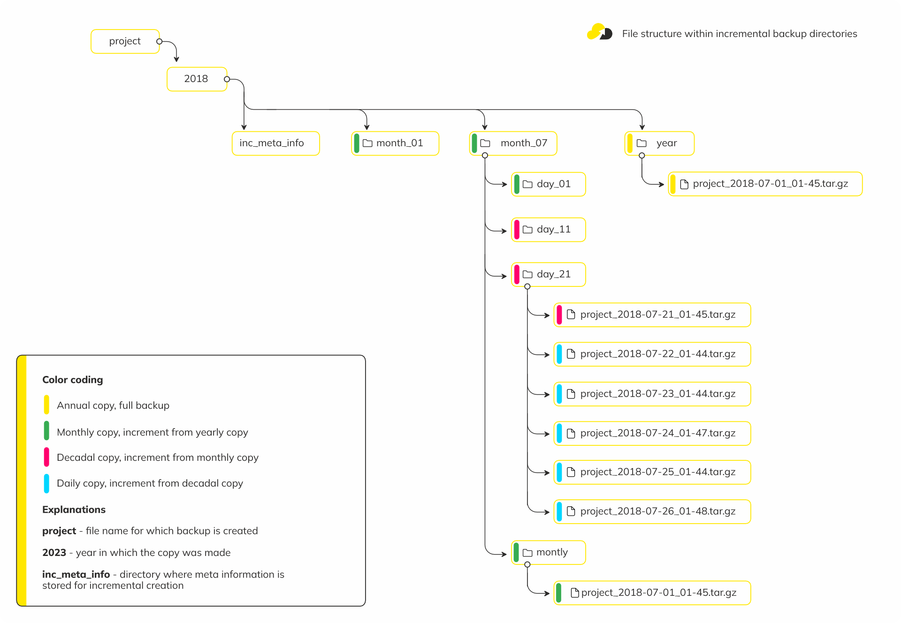

## 4. Restore ##

### 4.1. List backups ###

To display a list of created backups on all storage, just use the command `nxs-backup ls backups`.

The command takes the name of a job or group of jobs as an argument.
If no group is specified, the default value all is used.

The example below shows a list of files for all jobs on all storage:
```
$ nxs-backup ls backups
External backup jobs  # Group of exterbal backups
└── my_ext            # Job name
    └── ext_bak.sh    # External command used
        ├── local     # Storage name
        │   ├── /var/nxs-backup/ext/my_ext/daily/2024-07-23_11-02.bak
        │   ├── /var/nxs-backup/ext/my_ext/monthly/2024-07-01_11-02.bak
        │   └── /var/nxs-backup/ext/my_ext/weekly/2024-07-21_11-02.bak
        └── scp       # Storage name
            ├── /var/nxs-backup/ext/my_ext/daily/2024-07-18_11-02.bak
            ├── /var/nxs-backup/ext/my_ext/daily/2024-07-19_11-02.bak
            ├── /var/nxs-backup/ext/my_ext/daily/2024-07-20_11-02.bak
            ├── /var/nxs-backup/ext/my_ext/daily/2024-07-21_11-02.bak
            ├── /var/nxs-backup/ext/my_ext/daily/2024-07-22_11-02.bak
            └── /var/nxs-backup/ext/my_ext/daily/2024-07-23_11-02.bak
Database backup jobs  # Group of database backups
└── test_psql         # Job name
    ├── psql13/demo   # Target calculated during execution (db_source/database)
    │   ├── scp
    │   │   ├── /var/nxs-backup/psql13/demo/daily/demo_2024-07-22_11-03.sql.gz
    │   │   ├── /var/nxs-backup/psql13/demo/daily/demo_2024-07-23_11-03.sql.gz
    │   │   ├── /var/nxs-backup/psql13/demo/monthly/demo_2024-07-01_11-03.sql.gz
    │   │   └── /var/nxs-backup/psql13/demo/weekly/demo_2024-07-21_11-03.sql.gz
    │   └── local
    │       └── /var/nxs-backup/psql/psql13/demo/daily/demo_2024-07-23_11-03.sql.gz
    └── psql13/events # Target calculated during execution (db_source/database)
        ├── scp
        │   ├── /var/nxs-backup/db/psql13/events/daily/events_2024-07-22_11-03.sql.gz
        │   ├── /var/nxs-backup/db/psql13/events/daily/events_2024-07-23_11-03.sql.gz
        │   ├── /var/nxs-backup/db/psql13/events/monthly/events_2024-07-01_11-03.sql.gz
        │   └── /var/nxs-backup/db/psql13/events/weekly/events_2024-07-21_11-03.sql.gz
        └── local
            └── /var/nxs-backup/psql/psql13/events/daily/events_2024-07-23_11-03.sql.gz
File backup jobs      # Group of files backups
└── test_files        # Job name
    ├── www_data/p1   # Target calculated during execution (files_source/subdir)
    │   ├── scp
    │   │   ├── /var/nxs-backup/files/www_data/p1/daily/p1_2024-07-22_11-04.tar.gz
    │   │   ├── /var/nxs-backup/files/www_data/p1/daily/p1_2024-07-23_11-04.tar.gz
    │   │   ├── /var/nxs-backup/files/www_data/p1/monthly/p1_2024-07-01_11-04.tar.gz
    │   │   └── /var/nxs-backup/files/www_data/p1/weekly/p1_2024-07-21_11-04.tar.gz
    │   └── local
    │       └── /var/nxs-backup/files/www_data/p1/daily/p1_2024-07-23_11-02.tar.gz
    └── www_data/p2   # Target calculated during execution (files_source/subdir)
        ├── scp
        │   ├── /var/nxs-backup/files/www_data/p2/daily/p2_2024-07-22_11-04.tar.gz
        │   ├── /var/nxs-backup/files/www_data/p2/daily/p2_2024-07-23_11-04.tar.gz
        │   ├── /var/nxs-backup/files/www_data/p2/monthly/p2_2024-07-01_11-04.tar.gz
        │   └── /var/nxs-backup/files/www_data/p2/weekly/p2_2024-07-21_11-04.tar.gz
        └── local
            └── /var/nxs-backup/files/www_data/p2/daily/p2_2024-07-23_11-02.tar.gz
```

**Command reference:**
```
$ nxs-backup ls backups -h
nxs-backup 13.10.0
Usage: nxs-backup(fork) ls backups [JOB_NAME/GROUP_NAME]

Positional arguments:
  JOB_NAME/GROUP_NAME    Name of job or jobs group to run [default: all]

Global options:
  --config PATH, -c PATH
                         Path to config file [default: /etc/nxs-backup/nxs-backup.yml]
  --test-config, -t      Check if configuration correct
  --help, -h             display this help and exit
  --version              display version and exit
```


### 4.2. File backups ###

#### 4.2.1. Discrete file backups ####

To restore file backups, you have to ensure that you have GNU tar of whatever version is available on your OS.
Follow the usual rules for restoring from a GNU tar archive.

Be careful: handling below replaces each file with its "counterpart" in the archive, so be sure what you do.
```sh
sudo tar -xvpf /path/to/backup.tgz -C /
```

As a result of executing this command, the files contained in the archive will be unpacked
into the / directory, with their paths and access rights preserved and information about
the extraction process displayed.


#### 4.2.2. Incremental file backups ####

To restore incremental file backups, you have to ensure that you have GNU tar of whatever version
is available on your OS.

This diagram shows the general structure of file and directory storage with incremental copies.



To restore incremental files backup to the specific date, you have to untar files in the next sequence:

Annual copy (full-year backup) -> monthly copy -> decade copy -> daily copy

1. Unpack the full-year copy with the following command:

```sh
tar -xpGf /path/to/full/year/backup
```

2. Then alternately unpack the monthly, decade, and daily incremental backups, specifying a special key -G:

```sh
tar -xpGf /path/to/monthly/backup
tar -xpGf /path/to/decade/backup
tar -xpGf /path/to/day/backup
```

If you need to restore data for a date that falls at the beginning of a period, such as a month
or a decade, you should not restore from a decade or daily copy.

Be careful: handling below replaces each file with its "counterpart" in the archive, so be sure what you do.

Example:
```
# Tree of backups files
/var/nxs-backups
├── files
│   ├── desc [...]
│   └── inc
│       └── www
│           ├── project0
│           │   └── 2023
│           │       ├── inc_meta_info [...]
│           │       ├── month_01 [...]
│           │       ├── month_02 [...]
│           │       ├── month_03 [...]
│           │       ├── month_04 [...]
│           │       ├── month_05 [...]
│           │       ├── month_06 [...]
│           │       ├── month_07 [...]
│           │       │   ├── day_01 [...]
│           │       │   ├── day_11 [...]
│           │       │   ├── day_21
│           │       │   │   ├── project0_2023-07-21_01-45.tar.gz
│           │       │   │   ├── project0_2023-07-22_01-43.tar.gz
│           │       │   │   ├── project0_2023-07-23_01-44.tar.gz
│           │       │   │   ├── project0_2023-07-24_01-47.tar.gz
│           │       │   │   ├── project0_2023-07-25_01-44.tar.gz
│           │       │   │   └── project0_2023-07-26_01-48.tar.gz
│           │       │   └── montly
│           │       │       └── project0_2023-07-01_01-45.tar.gz
│           │       └── year
│           │           └── project0_2023-01-01_01-44.tar.gz
│           └── project1 [...]
└── databases [...]
```

```sh
# Restore files to July 26 of 2023
tar -xpGf /var/nxs-backups/files/inc/www/project0/2023/year/project0_2023-01-01_01-44.tar.gz -C /
tar -xpGf /var/nxs-backups/files/inc/www/project0/2023/month_07/montly/project0_2023-07-01_01-45.tar.gz -C /
tar -xpGf /var/nxs-backups/files/inc/www/project0/2023/month_07/day_21/project0_2023-07-21_01-45.tar.gz -C /
tar -xpGf /var/nxs-backups/files/inc/www/project0/2023/month_07/day_21/project0_2023-07-26_01-48.tar.gz -C /
```

As a result of executing this command, the files contained in the archives will be unpacked
into the / directory, with their paths and access rights preserved and information about
the extraction process displayed.


### 4.3. Database backups ###

#### 4.3.1. MySQL logical ####

Use standard tools for logical dump restoration.

More information you can find on the official documentation pages mysql 8.0 mysql 5.7.
Use a version of mysql, compatible with your database server version.

In general, the recovery order will be as follows: create the database to restore,
uncompress (if the backup was compressed), and restore the backup.

Step-by-step instruction:

1. Log into mysql server:
```
$ mysql -u root -p
- `-u` - user for loging to datase;
- `-p` - shell will ask you to prompt for a password before connecting to a database;
```

2. Create database if it doesn't exist
```
mysql> CREATE DATABASE production;
```

3. Exit to OS shell

4. Restore DB dump from OS shell:
```sh
# syntax
# mysql -u <username> -p <database_name> < /path/to/dump.sql
# example
$ gunzip < /var/nxs-backup/db/mysql/production/daily/mysql_production_2022-08-08_10-12.sql.gz | mysql -u root -p production
```


#### 4.3.2. MySQL physical (Xtrabackup) ####

Use Percona Xtrabackup for physical backup restoration.

More information can be found in the official documentation page xtrabackup 8.0 xtrabackup 2.4.
Use a version of xtrabackup, compatible with your database server version.

In general, the recovery order will be following: extract the backup to tmp directory, then restore
it using xtrabackup.

Step-by-step instruction:

1. Unarchive the backup to tmp directory:
```sh
$ tar -xvf /var/nxs-backup/db/xtarbackup/production/daily/production_2022-07-08_02-12.tar.gz -C /var/nxs-backup/tmp/recover
```

2. Prepare the backup for restoration. Skip this step if the option `prepare_xtrabackup` was enabled on backup creation.
```sh
$ xtrabackup --prepare --target-dir=/var/nxs-backup/tmp/recover/
```

3. Perform the recovery:
```sh
$ xtrabackup --move-back --target-dir=/var/nxs-backup/tmp/recover/
```


#### 4.3.3. PSQL logical ####

For restoring logical PostgreSQL dump use the standard `psql` tool.

Detailed information can be found in the official PostgreSQL documentation.

In general, the recovery order will be following: uncompress the backup (if the backup was compressed),
then restore it using the `psql` tool.

Examples:
```sh
# Basic example
$ psql -h <psql_host> -U <psql_user> -W prod < /var/nxs-backup/db/psql12/prod/daily/psql12_prod_2022_07_31_01-01.sql
# Decompress pipeline example
$ gunzip < /var/nxs-backup/db/psql12/prod/daily/psql12_prod_2022_07_31_01-01.sql.gz | psql -h <psql_host> -U <psql_user> -W prod
```


#### 4.3.4. PSQL physical ####

For restoring the physical PostgreSQL dump use the standard `pg_restore` tool.

Detailed information can be found in the official PostgreSQL documentation.

In general, the recovery order will be following: uncompress the backup (if the backup was compressed),
then restore it using the `pg_restore` tool.

Examples:
```sh
# Decompress dump
$ gunzip /var/nxs-backup/db/psql13/daily/psql13_2022_08_02_01-01.tar.gz
# Restoration of full dump (if you a performed backups of all databases)
# If database already exists:
$ pg_restore -U postgres -d prod < /var/nxs-backup/db/psql13/daily/psql13_2022_08_02_01-01.tar
# If database doesn't exists:
$ pg_restore -U postgres -C -d prod < /var/nxs-backup/db/psql13/daily/psql13_2022_08_02_01-01.tar
```


#### 4.3.5. MongoDB ####

For restoring MongoDB dump use the standard `mongorestore` tool.

Detailed information can be found in the official MongoDB documentation.

In general, the recovery order will be following: uncompress the backup, then restore it
using the `mongorestore` tool.

Step-by-step instruction:

1. Extract the backup to tmp directory:
```sh
$ tar -xvf /var/nxs-backup/db/mongo/production/prod/daily/prod_2022-09-02_02-12.tar.gz -C /var/nxs-backup/tmp/mongoresore
```

2. Perform the recovery:
```sh
# basic backup restore with collections drop
$ mongorestore --drop --dir /var/nxs-backup/tmp/mongoresore/dump/prod

# Restore only provided specific namespaces (collections) list
$ mongorestore --drop --dir /var/nxs-backup/tmp/mongoresore/dump/prod --nsInclude sessions.collection'

# Restore database without list of namespaces (collections)
$ mongorestore --drop --dir /var/nxs-backup/tmp/mongoresore/dump/prod --nsExclude sessions.collection'
```


#### 4.3.6. Redis ####

For restoring the Redis dump use the instructions below.

Detailed information can be found in theofficial Redis documentation.
In general, the recovery order will be following: uncompress the backup, copy the backup to the Redis
working directory, then restart the Redis.

Step-by-step instruction:

1. Stop Redis (because Redis overwrites the current rdb file when it exits).

2. Change the Redis config `appendonly` flag to `no` (otherwise Redis will ignore your rdb file when it starts).

3. Copy your backup rdb file to the Redis working directory (this is the dir option in your Redis config). Also, make sure your backup filename matches the `dbfilename` config option.
```sh
$ gunzip /var/nxs-backup/db/redis/prod/daily/prod_2022-09-05_01-11.rdb.gz
$ cp /var/nxs-backup/db/redis/prod/daily/prod_2022-09-05_01-11.rdb /var/lib/redis/dump.rdb   
$ chmod 660 /var/lib/redis/dump.rdb
```

4. Start Redis.
5. Run `redis-cli BGREWRITEAOF` to create a new appendonly file.
6. Restore the Redis config `appendonly` flag to `yes`


#### 4.4.1. User-defined script backup ####

When using a custom backup script, nxs-backup only serves to deliver backups to the storages
and perform rotation.
It is up to the user to take care of the correct restore method.

